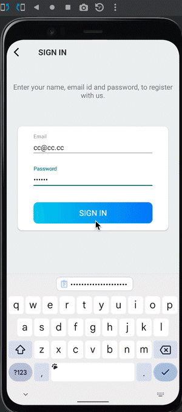

<h1>Stockholm Guider</h1>
Allows users to explore Stockholm through interaction, food, and more. 

<h2> Externally used library </h2>
<a href = "https://firebase.google.com/">Firebase</a> provides server and dashboard to manage one's own data. 

<h2>Credentials</h2>
mail: 
<b>cc@cc.cc</b> 
password:  
<b>cccccc</b> 

<h2>Screen Gif</h2>

